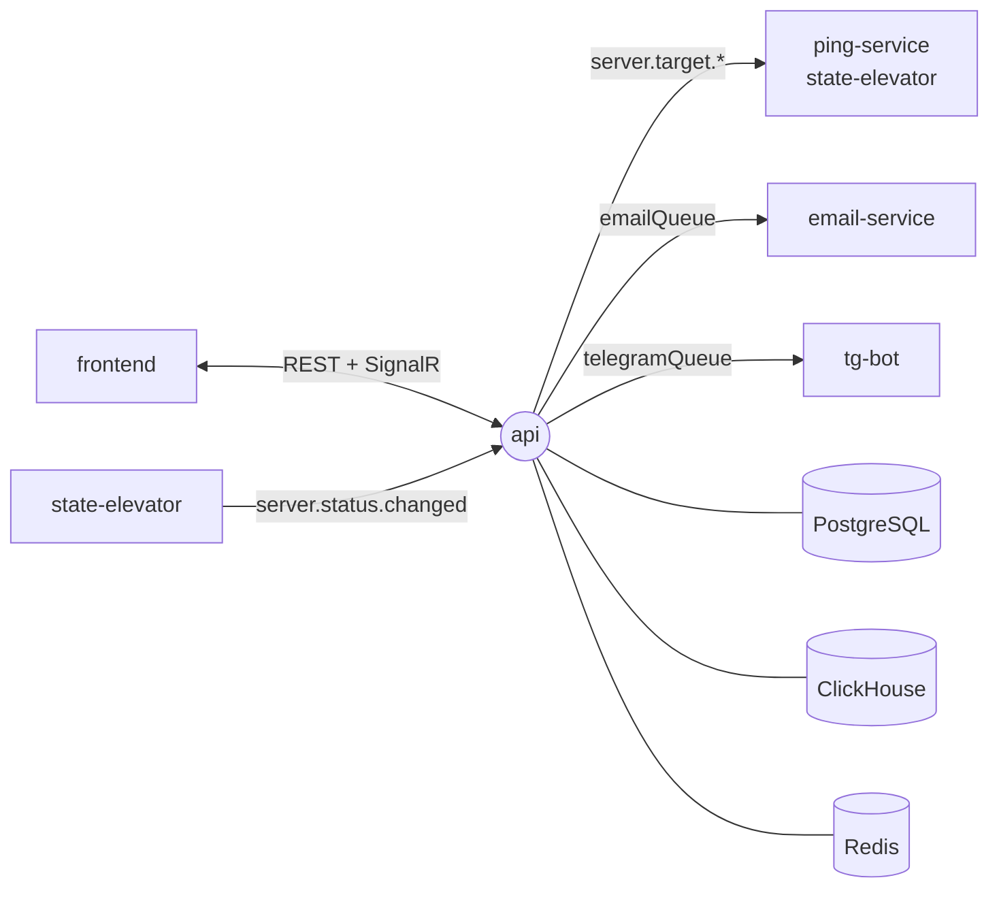

<div align="center">

<a href="https://gitlab.com/pingtower"></a>

# ⚙️ api

### REST API, live status hub, authentication and notification routing for PingTower

[](https://gitlab.com/pingtower/api/-/pipelines)


<sub>Part of <a href="https://gitlab.com/pingtower"><b>PingTower</b></a> — real-time server availability monitoring</sub>

</div>

---

## Role in the system

The api is the only entry point for users and the owner of all configuration. It stores servers, ping
settings and users in PostgreSQL, broadcasts every change to the monitoring pipeline, serves history from
ClickHouse, and closes the loop: when [state-elevator](https://gitlab.com/pingtower/state-elevator) reports
a status change, the api pushes it to the browser and fans it out to email and Telegram.



## Features

- **Auth** — registration with email confirmation, JWT access + refresh tokens, password reset, lockout and password policy via ASP.NET Identity; resend cooldowns on verification and reset emails.
- **Server management** — CRUD for monitored servers (HTTP/HTTPS/TCP/ICMP, host, port, query) and their ping settings: interval, retries, failure and latency thresholds.
- **Analytics** — ping history, latency charts, uptime stats and server overview straight from ClickHouse.
- **Live statuses** — SignalR hub pushes `server-status-changed` to the owner's connections the moment a status flips.
- **Notification routing** — per-user settings, email for confirmed addresses, Telegram for every linked account, Redis-backed cooldown (default 10 min) to prevent alert storms.
- **Telegram linking** — verifies Telegram Login Widget data before linking an account.
- **Architecture** — Clean Architecture + CQRS with MediatR; EF Core for writes and migrations, Dapper for read-heavy queries.

## Contracts

| Direction | Channel | Name | Payload |
| --- | --- | --- | --- |
| ⬅️ In | HTTP | `/api/auth`, `/api/servers`, `/api/users`, `/api/telegram-accounts` | REST, JWT bearer — see Swagger at `/swagger` |
| ➡️ Out | SignalR | `/hubs/monitoring` → `server-status-changed` | `{ serverId, status }` |
| ➡️ Out | exchange `serverEventsExchange` | `server.target.added` / `updated` / `deleted` | server + ping settings |
| ⬅️ In | queue ← `statusEventsExchange` | `q.api.status-events` (`server.status.changed`) | `{ server_id, status }` |
| ➡️ Out | work queue | `emailQueue` | `{ email, templateId, data }` |
| ➡️ Out | work queue | `telegramQueue` | `{ chatId, text, inlineButtons }` |
| 💾 Storage | PostgreSQL | `servers`, `ping_settings`, `users`, `tokens`, `telegram_accounts`, `notification_settings` | configuration |
| 💾 Storage | ClickHouse (read) | `server_pings` | ping history |
| 💾 Storage | Redis | `<prefix>:…` | notification cooldowns |

Health check: `GET /health/live`. Full message schemas: [`infra/rabbitmq/asyncapi.yaml`](https://gitlab.com/pingtower/infra/-/blob/main/rabbitmq/asyncapi.yaml).

### Main endpoints

| Area | Endpoints |
| --- | --- |
| Auth | `POST register` · `login` · `refresh` · `logout` · `verify-email` · `resend-verification-code` · `forgot-password` · `reset-password` |
| Servers | `GET` / `POST /api/servers` · `GET` / `PUT` / `DELETE /{id}` · `GET` / `PATCH /{id}/settings` · `GET /{id}/state` · `/{id}/uptime` · `/{id}/overview` · `/{id}/pings` |
| Users | `GET /api/users/me` · `GET` / `PATCH /api/users/notification-settings` |
| Telegram | `GET` / `POST /api/telegram-accounts` · `DELETE /{id}` |

## Quick start

**Whole stack** — via [infra](https://gitlab.com/pingtower/infra) (all repos cloned side by side); this also runs the migrations:

```bash
make -C infra up
```

**This service only** (storages and broker already running from infra):

```bash
cp .env.example .env
docker compose --profile tools run --rm migrator   # apply EF Core migrations
docker compose up -d --build api
```

**Local development:**

```bash
dotnet run --project src/Presentation
dotnet test src/src.sln
```

## Structure

```text
api/
├── src/
│   ├── Domain/            # entities, enums
│   ├── Application/       # MediatR commands/queries: Auth, Servers, Pings, State, Settings, NotificationSettings, TelegramAccounts
│   ├── Infrastructure/    # EF Core + migrations, Dapper, ClickHouse, RabbitMQ, Redis, Identity, email/Telegram publishers
│   └── Presentation/      # controllers, SignalR hub, Program.cs
└── tests/
    ├── Api.UnitTests/
    └── Api.IntegrationTests/
```
